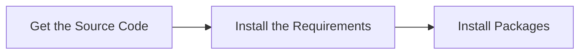
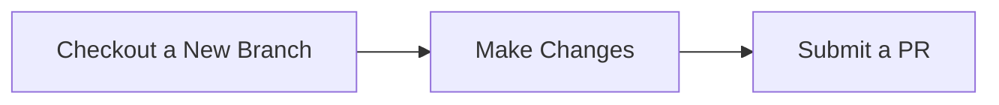
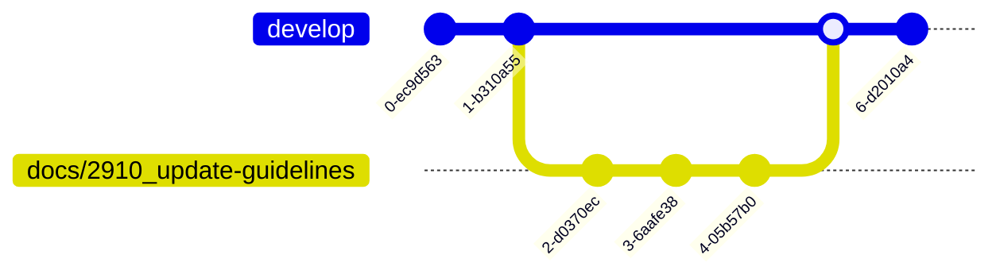
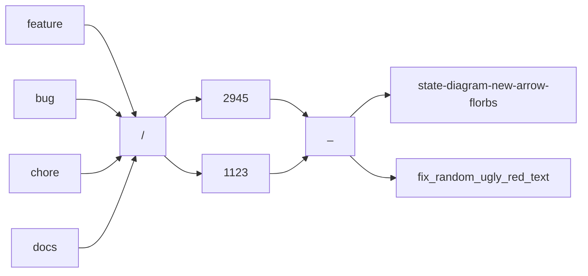
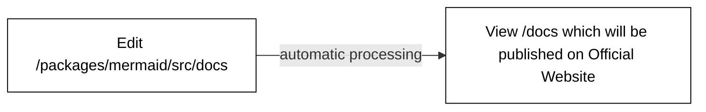

##### LLM INPUT #####
================================ System Message ================================

You are a developer. Your task is to install dependencies and set up a environment that is able to run the tests of the project.

- You start with an initial Docker container based on ubuntu:22.04.
- You interact with a Bash session inside this container.
- Project files are located in /testbed within the container, and your current working directory of bash is already set to /testbed.
- No need to clone the project again.

The final objective is to successfully run the tests of the project.


### TypeScript-Specific Instructions:
- Use npm, yarn, or pnpm to install dependencies (check package.json and lockfiles)
- Run `npm install` or `yarn install` to install dependencies
- Check package.json for test scripts and build commands
- Consider using `npm ci` for faster, reproducible builds if package-lock.json exists
- Install TypeScript globally if needed (e.g., `npm install -g typescript`)


================================ Human Message =================================


You run in a loop of Thought, Action, Observation.
At the end of the loop you should use Action to stop the loop.

Use Thought to describe your thoughts about the question you have been asked.
Use Action to run one of the actions available to you.
Observation will be the result of running those actions.
> Important Note: Each step, reply with only **one** (Thought, Action) pair.
> Important Note: Do not reply **Observation**, it will be provided by the system.

Your available actions are:

    Command: run a command in the bash, reply with following format, your command should not require sudo or interactive input:
        <command>bash command</command>
        e.g. install build-essential: <command>apt-get install -y build-essential</command>
        e.g. view file content: <command>cat README.md</command>
    Search: search the web for if you need some information, generate query and reply with following format:
        <search>the search query</search>
        e.g. <search>how to fix 'No module named setuptools'</search>
        e.g. <search>how to install python3 on ubuntu</search>
        e.g. <search>how to create development environment for python3</search>
    Stop: stop the setup loop once you think the setup is complete, reply with following format:
        <stop></stop>
    

Observation will be the result of running those actions.


Project Structure: the structure of the project, including files and directories.
Related Files: the content of related files of the project that may help you understand the project.
Thought: you should always think about what to do
Action: <command>your bash command here</command> or <search>your search query</search> or other actions available
Observation: the result of the action
... (this Thought/Action/Observation can repeat N times) ...
Thought: I think the setup should be fine
Action: <stop>stop the setup</stop>
Answer: the final result

Begin!
Project Structure: 📂 /home/hagon/Project/msb/EnvAgent/git/EnvBench/baseline_RepoLaunch/SWE-bench-Live/launch/playground/deepseek_v3_baseline/mermaid-js__mermaid-7287/repo
┣━━ 📂 .build
┣━━ 📂 .changeset
┣━━ 📂 .cspell
┣━━ 📂 .esbuild
┣━━ 📂 .github
┣━━ 📂 .husky
┣━━ 📂 .vite
┣━━ 📂 .vscode
┣━━ 📂 cypress
┣━━ 📂 demos
┣━━ 📂 docs
┣━━ 📂 img
┣━━ 📂 packages
┣━━ 📂 patches
┣━━ 📂 scripts
┣━━ 📂 tests
┣━━ 📄 .ackrc
┣━━ 📄 .editorconfig
┣━━ 📄 .hadolint.yaml
┣━━ 📄 .lintstagedrc.mjs
┣━━ 📄 .node-version
┣━━ 📄 .npmrc
┣━━ 📄 .prettierignore
┣━━ 📄 .prettierrc.json
┣━━ 📄 CHANGELOG.md
┣━━ 📄 CITATION.cff
┣━━ 📄 CODE_OF_CONDUCT.md
┣━━ 📄 CONTRIBUTING.md
┣━━ 📄 cspell.config.yaml
┣━━ 📄 cypress.config.ts
┣━━ 📄 docker-compose.yml
┣━━ 📄 Dockerfile
┣━━ 📄 eslint.config.js
┣━━ 📄 FUNDING.json
┣━━ 📄 LICENSE
┣━━ 📄 netlify.toml
┣━━ 📄 package.json
┣━━ 📄 pnpm-lock.yaml
┣━━ 📄 pnpm-workspace.yaml
┣━━ 📄 README.md
┣━━ 📄 README.zh-CN.md
┣━━ 📄 renovate.json
┣━━ 📄 run
┣━━ 📄 tsconfig.eslint.json
┣━━ 📄 tsconfig.json
┣━━ 📄 vite.config.ts
┗━━ 📄 vitest.workspace.js

Related Files: ------ BEGIN RELATED FILES ------
File: docker-compose.yml
```
services:
  mermaid:
    build:
      context: .
      dockerfile: Dockerfile
    stdin_open: true
    tty: true
    working_dir: /mermaid
    mem_limit: '8G'
    volumes:
      - ./:/mermaid
      - root_cache:/root/.cache
      - root_local:/root/.local
      - root_npm:/root/.npm
      - /tmp:/tmp
    ports:
      - 9000:9000
      - 3333:3333
  cypress:
    image: cypress/included:14.0.3
    stdin_open: true
    tty: true
    working_dir: /mermaid
    mem_limit: '2G'
    entrypoint: cypress
    environment:
      - DISPLAY
    volumes:
      - ./:/mermaid
      - /tmp/.X11-unix:/tmp/.X11-unix
    network_mode: host

volumes:
  root_cache:
  root_local:
  root_npm:

```
File: vite.config.ts
```
import jison from './.vite/jisonPlugin.js';
import jsonSchemaPlugin from './.vite/jsonSchemaPlugin.js';
import typescript from '@rollup/plugin-typescript';
import { defaultExclude, defineConfig } from 'vitest/config';

export default defineConfig({
  resolve: {
    extensions: ['.js'],
  },
  plugins: [
    jison(),
    jsonSchemaPlugin(), // handles .schema.yaml JSON Schema files
    typescript({ compilerOptions: { declaration: false } }),
  ],
  test: {
    environment: 'jsdom',
    globals: true,
    // TODO: should we move this to a mermaid-core package?
    coverage: {
      provider: 'v8',
      reporter: ['text', 'json', 'html', 'lcov'],
      reportsDirectory: './coverage/vitest',
      exclude: [...defaultExclude, './tests/**', '**/__mocks__/**', '**/generated/'],
    },
    includeSource: ['packages/*/src/**/*.{js,ts}'],
    clearMocks: true,
  },
  build: {
    /** If you set esmExternals to true, this plugins assumes that
     all external dependencies are ES modules */

    commonjsOptions: {
      esmExternals: true,
    },
  },
  define: {
    // Needs to be string
    'injected.includeLargeFeatures': 'true',
    'import.meta.vitest': 'undefined',
    packageVersion: "'0.0.0'",
  },
});

```
File: .github/workflows/test.yml
```
name: Unit Tests

on: [push, pull_request, merge_group]

permissions:
  contents: read

jobs:
  unit-test:
    runs-on: ubuntu-latest
    steps:
      - uses: actions/checkout@11bd71901bbe5b1630ceea73d27597364c9af683 # v4.2.2

      - uses: pnpm/action-setup@a7487c7e89a18df4991f7f222e4898a00d66ddda # v4.1.0
        # uses version from "packageManager" field in package.json

      - name: Setup Node.js
        uses: actions/setup-node@1d0ff469b7ec7b3cb9d8673fde0c81c44821de2a # v4.2.0
        with:
          cache: pnpm
          node-version-file: '.node-version'

      - name: Install Packages
        run: |
          pnpm install --frozen-lockfile
        env:
          CYPRESS_CACHE_FOLDER: .cache/Cypress

      - name: Run Unit Tests
        run: |
          pnpm test:coverage

      - name: Run ganttDb tests using California timezone
        env:
          # Makes sure that gantt db works even in a timezone that has daylight savings
          # since some days have 25 hours instead of 24.
          TZ: America/Los_Angeles
        run: |
          pnpm exec vitest run ./packages/mermaid/src/diagrams/gantt/ganttDb.spec.ts --coverage

      - name: Verify out-of-tree build with TypeScript
        run: |
          pnpm test:check:tsc

      - name: Upload Coverage to Codecov
        uses: codecov/codecov-action@13ce06bfc6bbe3ecf90edbbf1bc32fe5978ca1d3 # v5.3.1
        # Run step only pushes to develop and pull_requests
        if: ${{ github.event_name == 'pull_request' || github.ref == 'refs/heads/develop' }}
        with:
          files: ./coverage/vitest/lcov.info
          flags: unit
          name: mermaid-codecov
          fail_ci_if_error: false
          verbose: true
          token: 6845cc80-77ee-4e17-85a1-026cd95e0766

```
File: docs/community/contributing.md
```
> **Warning**
>
> ## THIS IS AN AUTOGENERATED FILE. DO NOT EDIT.
>
> ## Please edit the corresponding file in [/packages/mermaid/src/docs/community/contributing.md](../../packages/mermaid/src/docs/community/contributing.md).

# Mermaid Contributing Guide

You decided to take part in the development? Welcome!

We are trying to make our guidelines for you as explicit and detailed as possible.

## Initial Setup

Initial setup consists of 3 main steps:



### Get the Source Code

In GitHub, you first [**fork a mermaid repository**](https://github.com/mermaid-js/mermaid/fork) when you are going to make changes and submit pull requests.

Then you **clone** a copy to your local development machine (e.g. where you code) to make a copy with all the files to work with.

> **💡 Tip**
> [Here is a GitHub document that gives an overview of the process](https://docs.github.com/en/get-started/quickstart/fork-a-repo).

```bash
git clone git@github.com/your-fork/mermaid
```

Once you have cloned the repository onto your development machine, change into the `mermaid` project folder (the top level directory of the mermaid project repository)

```bash
cd mermaid
```

### Install Requirements

We support **development within Docker** environment along with **host setup**. You may choose it up to your preferences.

**Host**

These are the tools we use for working with the code and documentation:

- [Node.js](https://nodejs.org/en/).
- [pnpm](https://pnpm.io/) package manager.

The following commands must be sufficient enough to start with:

```bash
curl -fsSL https://get.pnpm.io/install.sh | sh -
pnpm env use --global 20
```

You may also need to reload `.shrc` or `.bashrc` afterwards.

**Docker**

[Install Docker](https://docs.docker.com/engine/install/). And that is pretty much all you need.

Optionally, to run GUI (Cypress) within Docker you will also need an X11 server installed.
You might already have it installed, so check this by running:

```bash
echo $DISPLAY
```

If the `$DISPLAY` variable is not empty, then an X11 server is running. Otherwise you may need to install one.

### Install Packages

**Host**

Install packages:

```bash
pnpm install
```

**Docker**

For development using Docker there is a self-documented `run` bash script, which provides convenient aliases for `docker compose` commands.

Make sure that `./run` script is executable:

```bash
chmod +x run
```

> **💡 Tip**
> To get detailed help simply type `./run` or `./run help`.
>
> It also has short _Development quick start guide_ embedded.

Then install packages:

```bash
./run pnpm install
```

### Verify Everything Works

This step is optional, but it helps to make sure that everything in development branch was OK before you started making any changes.

You can run the `test` script to verify that pnpm is working _and_ that the repository has been cloned correctly:

**Host**

```bash
pnpm test
```

**Docker**

```bash
./run pnpm test
```

The `test` script and others are in the top-level `package.json` file.

All tests should run successfully without any errors or failures.

> **Note**
> You might see _lint_ or _formatting_ warnings. Those are ok during this step.

## Workflow

Contributing process is very simple and straightforward:



Mermaid uses a [Git Flow](https://guides.github.com/introduction/flow/)–inspired approach to branching.

Development is done in the `develop` branch.



To prepare a new version for release the maintainers create a `release/vX.X.X` branch from `develop` for testing. Once the release happens we add a tag to the `release` branch and merge it with `master`. The live product and on-line documentation are what is in the `master` branch.

## Checkout a New Branch

> **💡 Tip**
> All new work should be based on the `develop` branch.

Make sure you have the most up-to-date version of the `develop` branch.

Check out the `develop` branch, then `fetch` or `pull` to update it:

```bash
git checkout develop
git fetch # or `git pull`
```

Create a new branch for your work:

```bash
git checkout -b docs/2910_update-contributing-guidelines
```

We use the following naming convention for branches:

```txt
[feature | bug | chore | docs]/[issue number]_[short-description]
```

You can always check current [configuration of labelling and branch prefixes](https://github.com/mermaid-js/mermaid/blob/develop/.github/pr-labeler.yml)

- The first part is the **type** of change: a `feature`, `bug`, `chore`, `docs`
- followed by a **slash** (`/`),which helps to group like types together in many git tools
- followed by the **issue number**, e.g. `2910`
- followed by an **underscore** (`_`)
- followed by a **short description** with dashes (`-`) or underscores (`_`) instead of spaces



If your work is specific to a single diagram type, it is a good idea to put the diagram type at the start of the description. This will help us keep release notes organized by a diagram type.

> **Note**
> A new feature described in issue 2945 that adds a new arrow type called 'florbs' to state diagrams
>
> `feature/2945_state-diagram-new-arrow-florbs`

> **💡 Tip**
> A bug described in issue 1123 that causes random ugly red text in multiple diagram types
>
> `bug/1123_fix_random_ugly_red_text`

## Contributing Code

Code is the heart of every software project. We strive to make it better. Who if not us?

### Where is the Code Located?

The core of Mermaid is located under `packages/mermaid/src`.

### Building Mermaid Locally

**Host**

```bash
pnpm run build
```

**Docker**

```bash
./run build
```

This will build the Mermaid library and the documentation site.

### Running Mermaid Locally

**Host**

```bash
pnpm run dev
```

**Docker**

```bash
./run dev
```

After starting the dev server open <http://localhost:9000> in your browser.

Now you are ready to make your changes!

### Make Changes

Have a look at <http://localhost:9000>. There is a list of demos that can be used to see and test your changes.

If you need a specific diagram, you can duplicate the `example.html` file in `/demos/dev` and add your own mermaid code to your copy.

That will be served at <http://localhost:9000/dev/your-file-name.html>.
After making code changes, the dev server will rebuild the mermaid library and automatically reload the page.

Edit files in `packages/mermaid/src` as required.

### Write Tests

Tests ensure that each function, module, or part of code does what it says it will do. This is critically important when other changes are made to ensure that existing code is not broken (no regression).

Just as important, the tests act as _specifications:_ they specify what the code does (or should do).
Whenever someone is new to a section of code, they should be able to read the tests to get a thorough understanding of what it does and why.

If you are fixing a bug, you should add tests to ensure that your code has actually fixed the bug, to specify/describe what the code is doing, and to ensure the bug doesn't happen again.
(If there had been a test for the situation, the bug never would have happened in the first place.)
You may need to change existing tests if they were inaccurate.

If you are adding a feature, you will definitely need to add tests. Depending on the size of your feature, you may need to add integration tests.

#### Unit Tests

Unit tests are tests that test a single function or module. They are the easiest to write and the fastest to run.

Unit tests are mandatory for all code except the layout tests. (The layouts are tested with integration tests.)

We use [Vitest](https://vitest.dev) to run unit tests.

**Host**

You can use the following command to run the unit tests:

```sh
pnpm test
```

When writing new tests, it's easier to have the tests automatically run as you make changes. You can do this by running the following command:

```sh
pnpm test:watch
```

**Docker**

When using Docker prepend your command with `./run`:

```sh
./run pnpm test
```

##### Testing the DOM

One can use `jsdomIt` to test any part of Mermaid that interacts with the DOM, as long as it is not related to the layout.

The function `jsdomIt` ([developed in utils.ts](../../tests/util.ts)) overrides `it` from `vitest`, and creates a pseudo-browser environment that works almost like the real deal for the duration of the test. It uses JSDOM to create a DOM, and adds objects `window` and `document` to `global` to mock the browser environment.

> \[!NOTE]
> The layout cannot work in `jsdomIt` tests because JSDOM has no rendering engine, hence the pseudo-browser environment.

Example :

```typescript
import { ensureNodeFromSelector, jsdomIt } from './tests/util.js';

jsdomIt('should add element "thing" in the SVG', ({ svg }) => {
  // Code in this block runs in a pseudo-browser environment
  addThing(svg); // The svg item is the D3 selection of the SVG node
  const svgNode = ensureNodeFromSelector('svg'); // Retrieve the DOM node using the DOM API
  expect(svgNode.querySelector('thing')).not.toBeNull(); // Test the structure of the SVG
});
```

They can be used to test any method that interacts with the DOM, including for testing renderers. For renderers, additional integration testing is necessary to test the layout though.

#### Integration / End-to-End (E2E) Tests

These test the rendering and visual appearance of the diagrams.

This ensures that the rendering of that feature in the E2E will be reviewed in the release process going forward. Less chance that it breaks!

To start working with the E2E tests:

**Host**

- Run `pnpm dev` to start the dev server
- Start **Cypress** by running `pnpm cypress:open`

**Docker**

- Enable local connections for x11 server `xhost +local:`
- Run `./run pnpm dev` to start the dev server
- Start **Cypress** by running `./run pnpm cypress:open --project .`

The rendering tests are very straightforward to create. There is a function `imgSnapshotTest`, which takes a diagram in text form and the mermaid options, and it renders that diagram in Cypress.

When running in CI it will take a snapshot of the rendered diagram and compare it with the snapshot from last build and flag it for review if it differs.

This is what a rendering test looks like:

```js
it('should render forks and joins', () => {
  imgSnapshotTest(
    `
    stateDiagram
    state fork_state &lt;&lt;fork&gt;&gt;
      [*] --> fork_state
      fork_state --> State2
      fork_state --> State3

      state join_state &lt;&lt;join&gt;&gt;
      State2 --> join_state
      State3 --> join_state
      join_state --> State4
      State4 --> [*]
    `,
    { logLevel: 0 }
  );
});
```

<!-- **_[TODO - running the tests against what is expected in development. ]_** -->

<!-- **_[TODO - how to generate new screenshots]_** -->

### Update Documentation

> **💡 Tip**
> Our documentation is managed in `packages/mermaid/src/docs`. Details on how to edit is in the [documentation section](#contributing-documentation)

If the users have no way to know that things have changed, then you haven't really _fixed_ anything for the users; you've just added to making Mermaid feel broken.
Likewise, if users don't know that there is a new feature that you've implemented, it will forever remain unknown and unused.

The documentation has to be updated for users to know that things have been changed and added!
If you are adding a new feature, add `(v<MERMAID_RELEASE_VERSION>+)` in the title or description. It will be replaced automatically with the current version number when the release happens.

eg: `# Feature Name (v<MERMAID_RELEASE_VERSION>+)`

We know it can sometimes be hard to code _and_ write user documentation.

Create another issue specifically for the documentation.
You will need to help with the PR, but definitely ask for help if you feel stuck.
When it feels hard to write stuff out, explaining it to someone and having that person ask you clarifying questions can often be 80% of the work!

When in doubt, write up and submit what you can. It can be clarified and refined later. (With documentation, something is better than nothing!)

## Contributing Documentation

If it is not in the documentation, it's like it never happened. Wouldn't that be sad? With all the effort that was put into the feature?

### Where is the Documentation Located?

> **Warning**
> DO NOT CHANGE FILES IN `/docs`
>
> The `docs` folder will be automatically generated when committing to `packages/mermaid/src/docs` and **should not** be edited manually.

Documentation is located in the [`packages/mermaid/src/docs`](https://github.com/mermaid-js/mermaid/tree/develop/packages/mermaid/src/docs) folder. Just pick the right section and start typing.

The contents of [mermaid.js.org](https://mermaid.js.org/) are based on the docs from the `master` branch. Updates committed to the `master` branch are reflected in the [Mermaid Docs](https://mermaid.js.org/) once published.




### Running the Documentation Website Locally

**[The mermaid documentation site](https://mermaid.js.org/) is powered by [Vitepress](https://vitepress.vuejs.org/).**

Start development server for the documentation site

**Host**

```bash
pnpm --filter mermaid run docs:dev
```

or

```bash
cd packages/mermaid
pnpm docs:dev
```

**Docker**

```bash
./run docs:dev
```

Open <http://localhost:3333/> in your browser.

### Formatting

The documentation is written in Markdown. To get acquainted with its syntax [see the GitHub Markdown help page](https://help.github.com/en/github/writing-on-github/basic-writing-and-formatting-syntax).

You can use `note`, `tip`, `warning` and `danger` in triple backticks to add a note, tip, warning or danger box.

> **‼️ Danger**
> Do not use vitepress specific markdown syntax `::: warning` as it will not be processed correctly.

Here are a few examples:

````markdown
```note
This is a note
```

```tip
This is a tip
```

```warning
This is a warning
```

```danger
This is a danger alert
```
````

> **Note**
> This is a note

> **💡 Tip**
> This is a tip

> **Warning**
> This is a warning

> **‼️ Danger**
> This is a danger alert

### Navigation

If you want to propose changes to how the documentation is _organized_, such as adding a new section or re-arranging or renaming a section, you must update the **sidebar navigation**, which is defined in [the vitepress config](../.vitepress/config.ts). The same goes for **topbar**.

### Build Docs

The content of `/docs` folder is built with GitHub Actions.

> **Warning**
> So as to allow automatic compilation of documentation pages you have to enable GitHub Actions on your fork first

## Submit your pull request

> **Note**
> Do not forget to push your changes
>
> ```bash
> git push -u origin docs/2910_update-guidelines
> ```

We make all changes via Pull Requests (PRs). Open a new one.

Right now we are not following any strict rules about naming PRs. Give it a representative title and short description. There is also a [pull request template](https://github.com/mermaid-js/mermaid/blob/develop/.github/pull_request_template.md) which will help you with it.

In case in its description contains a [magic comment](https://docs.github.com/en/issues/tracking-your-work-with-issues/linking-a-pull-request-to-an-issue) your PR will be automatically attached to the issue:

```markdown
Resolves #<your issue ID here>
```

## Congratulations

You have successfully submitted your improvements! What is next?

- PRs will be reviewed by active maintainers, who will provide feedback and request changes as needed.
- The maintainers will request a review from _knsv_, if necessary.
- Once the PR is approved, the maintainers will merge the PR into the `develop` branch.
- When a release is ready, the `release/x.x.x` branch will be created, extensively tested and knsv will be in charge of the release process.

Thanks for you help!

<!--- cspell:ignore florbs --->

```
File: pnpm-workspace.yaml
```
packages:
  - 'packages/*'
  - 'packages/mermaid/src/docs'
  - 'packages/mermaid/src/vitepress'
  - 'tests/*'

```
File: cypress.config.ts
```
import eyesPlugin from '@applitools/eyes-cypress';
import { registerArgosTask } from '@argos-ci/cypress/task';
import coverage from '@cypress/code-coverage/task.js';
import { defineConfig } from 'cypress';
import { addMatchImageSnapshotPlugin } from 'cypress-image-snapshot/plugin.js';
import cypressSplit from 'cypress-split';

export default eyesPlugin(
  defineConfig({
    projectId: 'n2sma2',
    viewportWidth: 1440,
    viewportHeight: 1024,
    e2e: {
      specPattern: 'cypress/integration/**/*.{js,ts}',
      setupNodeEvents(on, config) {
        coverage(on, config);
        cypressSplit(on, config);
        on('before:browser:launch', (browser, launchOptions) => {
          if (browser.name === 'chrome' && browser.isHeadless) {
            launchOptions.args.push('--window-size=1440,1024', '--force-device-scale-factor=1');
          }
          return launchOptions;
        });
        // copy any needed variables from process.env to config.env
        config.env.useAppli = process.env.USE_APPLI ? true : false;
        config.env.useArgos = process.env.RUN_VISUAL_TEST === 'true';

        if (config.env.useArgos) {
          registerArgosTask(on, config, {
            // Enable upload to Argos only when it runs on CI.
            uploadToArgos: !!process.env.CI,
          });
        } else {
          addMatchImageSnapshotPlugin(on, config);
        }
        // do not forget to return the changed config object!
        return config;
      },
    },
    video: false,
  })
);

```
File: docs/config/usage.md
```
> **Warning**
>
> ## THIS IS AN AUTOGENERATED FILE. DO NOT EDIT.
>
> ## Please edit the corresponding file in [/packages/mermaid/src/docs/config/usage.md](../../packages/mermaid/src/docs/config/usage.md).

# Usage

Mermaid is a JavaScript tool that makes use of a Markdown based syntax to render customizable diagrams, charts and visualizations.

Diagrams can be re-rendered/modified by modifying their descriptions.

### CDN

<https://www.jsdelivr.com/package/npm/mermaid>

Please note that you can switch versions through the dropdown box at the top right.

## Using mermaid

For the majority of users, Using the [Live Editor](https://mermaid.live/) would be sufficient, however you may also opt to deploy mermaid as a dependency or using the [Mermaid API](./setup/README.md).

We have compiled some Video [Tutorials](../ecosystem/tutorials.md) on how to use the Mermaid Live Editor.

### Installing and Hosting Mermaid on a Webpage

**Using the npm package:**

Requirements:

- Node >= 16

```bash
# NPM
npm install mermaid
# Yarn
yarn add mermaid
# PNPM
pnpm add mermaid
```

**Hosting mermaid on a web page:**

> Note: This topic is explored in greater depth in the [User Guide for Beginners](../intro/getting-started.md)

The easiest way to integrate mermaid on a web page requires two elements:

- A graph definition, inside `<pre>` tags labeled `class=mermaid`.

Example:

```html
<pre class="mermaid">
    graph LR
    A --- B
    B-->C[fa:fa-ban forbidden]
    B-->D(fa:fa-spinner);
</pre>
```

- The mermaid js script. Added using a `script` tag as an ESM import.

Example:

```html
<script type="module">
  import mermaid from 'https://cdn.jsdelivr.net/npm/mermaid@11/dist/mermaid.esm.min.mjs';
</script>
```

**Following these directions, mermaid starts at page load and (when the page has loaded) it will locate the graph definitions inside the `pre` tags with `class="mermaid"` and return diagrams in SVG form, following given definitions.**

## Simple full example:

```html
<!doctype html>
<html lang="en">
  <body>
    <pre class="mermaid">
  graph LR
      A --- B
      B-->C[fa:fa-ban forbidden]
      B-->D(fa:fa-spinner);
    </pre>
    <script type="module">
      import mermaid from 'https://cdn.jsdelivr.net/npm/mermaid@11/dist/mermaid.esm.min.mjs';
    </script>
  </body>
</html>
```

## Notes:

An id attribute is also added to mermaid tags without one.

Mermaid can load multiple diagrams, in the same page.

> Try it out, save this code as HTML and load it using any browser.
> (Except Internet Explorer, please don't use Internet Explorer.)

## Tiny Mermaid

We offer a smaller version of Mermaid that's approximately half the size of the full library. This tiny version doesn't support Mindmap Diagrams, Architecture Diagrams, KaTeX rendering, or lazy loading.

If you need a more lightweight version without these features, you can use [Mermaid Tiny](https://github.com/mermaid-js/mermaid/tree/develop/packages/tiny).

## Enabling Click Event and Tags in Nodes

A `securityLevel` configuration has to first be cleared. `securityLevel` sets the level of trust for the parsed diagrams and limits click functionality. This was introduced in version 8.2 as a security improvement, aimed at preventing malicious use.

**It is the site owner's responsibility to discriminate between trustworthy and untrustworthy user-bases and we encourage the use of discretion.**

## securityLevel

| Parameter     | Description                       | Type   | Required | Values                                     |
| ------------- | --------------------------------- | ------ | -------- | ------------------------------------------ |
| securityLevel | Level of trust for parsed diagram | String | Optional | 'sandbox', 'strict', 'loose', 'antiscript' |

Values:

- **strict**: (**default**) HTML tags in the text are encoded and click functionality is disabled.
- **antiscript**: HTML tags in text are allowed (only script elements are removed) and click functionality is enabled.
- **loose**: HTML tags in text are allowed and click functionality is enabled.
- **sandbox**: With this security level, all rendering takes place in a sandboxed iframe. This prevents any JavaScript from running in the context. This may hinder interactive functionality of the diagram, like scripts, popups in the sequence diagram, links to other tabs or targets, etc.

> **Note**
> This changes the default behaviour of mermaid so that after upgrade to 8.2, unless the `securityLevel` is not changed, tags in flowcharts are encoded as tags and clicking is disabled.
> **sandbox** security level is still in the beta version.

**If you are taking responsibility for the diagram source security you can set the `securityLevel` to a value of your choosing. This allows clicks and tags are allowed.**

**To change `securityLevel`, you have to call `mermaid.initialize`:**

```javascript
mermaid.initialize({
  securityLevel: 'loose',
});
```

### Labels out of bounds

If you use dynamically loaded fonts that are loaded through CSS, such as fonts, mermaid should wait for the whole page to load (dom + assets, particularly the fonts file).

```javascript
$(document).ready(function () {
  mermaid.initialize();
});
```

Not doing so will most likely result in mermaid rendering graphs that have labels out of bounds. The default integration in mermaid uses the window\.load event to start rendering.

If your page has other fonts in its body those might be used instead of the mermaid font. Specifying the font in your styling is a workaround for this.

```css
pre.mermaid {
  font-family: 'trebuchet ms', verdana, arial;
}
```

### Using `mermaid.run`

mermaid.run was added in v10 and is the preferred way of handling more complex integration.
By default, `mermaid.run` will be called when the document is ready, rendering all elements with `class="mermaid"`.

You can customize that behavior by calling `await mermaid.run(<config>)`.

`mermaid.initialize({startOnLoad: false})` will prevent `mermaid.run` from being called automatically after load.

Render all elements with querySelector ".someOtherClass"

```js
mermaid.initialize({ startOnLoad: false });
await mermaid.run({
  querySelector: '.someOtherClass',
});
```

Render all elements passed as an array

```js
mermaid.initialize({ startOnLoad: false });
await mermaid.run({
  nodes: [document.getElementById('someId'), document.getElementById('anotherId')],
});
await mermaid.run({
  nodes: document.querySelectorAll('.yetAnotherClass'),
});
```

Render all `.mermaid` elements while suppressing any error

```js
mermaid.initialize({ startOnLoad: false });
await mermaid.run({
  suppressErrors: true,
});
```

### Calling `mermaid.init` - Deprecated

> **Warning**
> mermaid.init is deprecated in v10 and will be removed in a future release. Please use mermaid.run instead.

By default, `mermaid.init` will be called when the document is ready, finding all elements with
`class="mermaid"`. If you are adding content after mermaid is loaded, or otherwise need
finer-grained control of this behavior, you can call `init` yourself with:

- a configuration object
- some nodes, as
  - a node
  - an array-like of nodes
  - or W3C selector that will find your nodes

Example:

```
... (truncated due to size)

================================ Human Message =================================


The commands you have run:```
curl -fsSL https://deb.nodesource.com/setup_20.x | bash - && apt-get install -y nodejs, npm install -g pnpm, ls /usr/bin/node* /usr/bin/npm*, apt-get install -y npm, apt-get update && apt-get install -y npm, npm install -g pnpm && pnpm install```
Following are the last 5 messages:

================================ Human Message =================================

Observation:
apt-get install -y npm
Reading package lists... 0%Reading package lists... 0%Reading package lists... 0%Reading package lists... 3%Reading package lists... 3%Reading package lists... 4%Reading package lists... 4%Reading package lists... 39%Reading package lists... 39%Reading package lists... 40%Reading package lists... 40%Reading package lists... 50%Reading package lists... 50%Reading package lists... 66%Reading package lists... 66%Reading package lists... 70%Reading package lists... 70%Reading package lists... 70%Reading package lists... 70%Reading package lists... 71%Reading package lists... 71%Reading package lists... 71%Reading package lists... 71%Reading package lists... 80%Reading package lists... 80%Reading package lists... 96%Reading package lists... 96%Reading package lists... 99%Reading package lists... 99%Reading package lists... 99%Reading package lists... 99%Reading package lists... Done
Building dependency tree... 0%Building dependency tree... 0%Building dependency tree... 50%Building dependency tree... 50%Building dependency tree... 94%Building dependency tree... Done
Reading state information... 0% Reading state information... 2%Reading state information... Done
The following additional packages will be installed:
  adwaita-icon-theme at-spi2-core binutils binutils-common
  binutils-x86-64-linux-gnu build-essential bzip2 cpp cpp-11 dbus
  dbus-user-session dconf-gsettings-backend dconf-service dirmngr dmsetup
  dpkg-dev fakeroot fontconfig fontconfig-config fonts-dejavu-core g++ g++-11
  gcc gcc-11 gcc-11-base gir1.2-glib-2.0 gnupg gnupg-l10n gnupg-utils gpg
  gpg-agent gpg-wks-client gpg-wks-server gpgconf gpgsm
  gsettings-desktop-schemas gtk-update-icon-cache gyp hicolor-icon-theme
  humanity-icon-theme libalgorithm-diff-perl libalgorithm-diff-xs-perl
  libalgorithm-merge-perl libapparmor1 libargon2-1 libasan6 libassuan0
  libatk-bridge2.0-0 libatk1.0-0 libatk1.0-data libatomic1 libatspi2.0-0
  libauthen-sasl-perl libavahi-client3 libavahi-common-data libavahi-common3
  libbinutils libc-dev-bin libc-devtools libc6-dev libcairo-gobject2 libcairo2
  libcc1-0 libclone-perl libcolord2 libcrypt-dev libcryptsetup12 libctf-nobfd0
  libctf0 libcups2 libdata-dump-perl libdatrie1 libdbus-1-3 libdconf1
  libdeflate0 libdevmapper1.02.1 libdpkg-perl libdrm-amdgpu1 libdrm-common
  libdrm-intel1 libdrm-nouveau2 libdrm-radeon1 libdrm2 libelf1
  libencode-locale-perl libepoxy0 libfakeroot libfile-basedir-perl
  libfile-desktopentry-perl libfile-fcntllock-perl libfile-listing-perl
  libfile-mimeinfo-perl libfont-afm-perl libfontconfig1 libfontenc1
  libfreetype6 libfribidi0 libgcc-11-dev libgd3 libgdk-pixbuf-2.0-0
  libgdk-pixbuf2.0-bin libgdk-pixbuf2.0-common libgirepository-1.0-1 libgl1
  libgl1-amber-dri libgl1-mesa-dri libglapi-mesa libglib2.0-0 libglib2.0-data
  libglvnd0 libglx-mesa0 libglx0 libgomp1 libgraphite2-3 libgtk-3-0
  libgtk-3-bin libgtk-3-common libgtkd-3-0 libharfbuzz0b libhtml-form-perl
  libhtml-format-perl libhtml-parser-perl libhtml-tagset-perl
  libhtml-tree-perl libhttp-cookies-perl libhttp-daemon-perl libhttp-date-perl
  libhttp-message-perl libhttp-negotiate-perl libice6 libio-html-perl
  libio-socket-ssl-perl libio-stringy-perl libip4tc2 libipc-system-simple-perl
  libisl23 libitm1 libjbig0 libjpeg-turbo8 libjpeg8 libjs-events
  libjs-inherits libjs-is-typedarray libjs-psl libjs-source-map
  libjs-sprintf-js libjs-typedarray-to-buffer libjson-c5 libkmod2 libksba8
  liblcms2-2 libllvm11 libllvm15 liblocale-gettext-perl liblsan0
  liblwp-mediatypes-perl liblwp-protocol-https-perl libmailtools-perl libmpc3
  libmpdec3 libmpfr6 libnet-dbus-perl libnet-http-perl libnet-smtp-ssl-perl
  libnet-ssleay-perl libnode-dev libnotify-bin libnotify4 libnpth0 libnsl-dev
  libnss-systemd libpam-systemd libpango-1.0-0 libpangocairo-1.0-0
  libpangoft2-1.0-0 libpciaccess0 libphobos2-ldc-shared98 libpixman-1-0
  libpng16-16 libpython3-stdlib libpython3.10-minimal libpython3.10-stdlib
  libquadmath0 libreadline8 librsvg2-2 librsvg2-common libsensors-config
  libsensors5 libsm6 libsqlite3-0 libssl-dev libstdc++-11-....stripped due to length....
                                      44.7 kB/s 23s99% [Waiting for headers]                                         44.7 kB/s 23s                                                                               Get:449 http://archive.ubuntu.com/ubuntu jammy/universe amd64 node-gyp all 8.4.1-1 [34.7 kB]
99% [449 node-gyp 23.2 kB/34.7 kB 67%]                            44.7 kB/s 23s99% [Working]                                                     44.7 kB/s 22s99% [Waiting for headers]                                         44.7 kB/s 22s                                                                               Get:450 http://archive.ubuntu.com/ubuntu jammy/universe amd64 node-ini all 2.0.1-1 [6528 B]
99% [450 node-ini 2896 B/6528 B 44%]                              44.7 kB/s 22s99% [Working]                                                     44.7 kB/s 22s99% [Waiting for headers]                                         44.7 kB/s 22s                                                                               Get:451 http://archive.ubuntu.com/ubuntu jammy/universe amd64 node-negotiator all 0.6.2+~0.6.1-1 [10.3 kB]
99% [451 node-negotiator 1448 B/10.3 kB 14%]                      44.7 kB/s 22s99% [Working]                                                     44.7 kB/s 22s99% [Waiting for headers]                                         44.7 kB/s 22s                                                                               Get:452 http://archive.ubuntu.com/ubuntu jammy/universe amd64 node-resolve all 1.20.0+~cs5.27.9-1 [20.7 kB]
99% [452 node-resolve 0 B/20.7 kB 0%]                             44.7 kB/s 22s99% [Working]                                                     44.7 kB/s 21s99% [Waiting for headers]                                         21.5 kB/s 45s                                                                               Get:453 http://archive.ubuntu.com/ubuntu jammy/universe amd64 node-normalize-package-data all 3.0.3+~2.4.1-1 [12.8 kB]
99% [453 node-normalize-package-data 2896 B/12.8 kB 23%]          21.5 kB/s 45s99% [Connecting to archive.ubuntu.com (185.125.190.81)]           21.5 kB/s 45s99% [Waiting for headers]                                         21.5 kB/s 45s                                                                               Get:454 http://archive.ubuntu.com/ubuntu jammy/universe amd64 node-read-package-json all 4.1.1-1 [10.4 kB]
99% [454 node-read-package-json 2896 B/10.4 kB 28%]               21.5 kB/s 44s99% [Working]                                                     21.5 kB/s 44s99% [Waiting for headers]                                         21.5 kB/s 44s99% [Waiting for headers]                                         21.5 kB/s 44s                                                                               Get:455 http://archive.ubuntu.com/ubuntu jammy/universe amd64 node-tap all 12.0.1+ds-4 [43.6 kB]
99% [455 node-tap 18.8 kB/43.6 kB 43%]                            21.5 kB/s 43s100% [Working]                                                    21.5 kB/s 42s100% [Waiting for headers]                                        21.5 kB/s 42s100% [Waiting for headers]                                        21.5 kB/s 42s100% [Waiting for headers]                                        21.5 kB/s 42s100% [Waiting for headers]                                        21.5 kB/s 42s                                                                               Get:456 http://archive.ubuntu.com/ubuntu jammy/universe amd64 npm all 8.5.1~ds-1 [894 kB]
100% [456 npm 13.0 kB/894 kB 1%]                                  21.5 kB/s 41s100% [Working]                                                     21.5 kB/s 0s                                                                               Fetched 179 MB in 11min 8s (268 kB/s)
E: Failed to fetch http://archive.ubuntu.com/ubuntu/pool/main/libp/libpciaccess/libpciaccess0_0.16-3_amd64.deb  500  reading HTTP response body: unexpected EOF [IP: 185.125.190.83 80]
E: Unable to fetch some archives, maybe run apt-get update or try with --fix-missing?


root@d824b822ebb6:/testbed $

exit code: 100

================================== Ai Message ==================================

Thought: The package installation failed due to network issues. I should run apt-get update and try installing npm again.

Action: <command>apt-get update && apt-get install -y npm</command>
================================ Human Message =================================

Observation:
apt-get update && apt-get install -y npm
0% [Working]0% [Waiting for headers] [Waiting for headers]                                              Hit:1 http://security.ubuntu.com/ubuntu jammy-security InRelease
                                              0% [Waiting for headers]                        Hit:2 http://archive.ubuntu.com/ubuntu jammy InRelease
                        0% [Working]0% [Connecting to archive.ubuntu.com (91.189.91.81)]                                                    0% [Waiting for headers]0% [Waiting for headers]0% [Waiting for headers]                        Get:3 http://archive.ubuntu.com/ubuntu jammy-updates InRelease [128 kB]
0% [3 InRelease 5792 B/128 kB 5%]                                 0% [Working]0% [Waiting for headers]0% [Waiting for headers]                        Hit:4 http://archive.ubuntu.com/ubuntu jammy-backports InRelease
                        0% [Working]100% [Working]              Fetched 128 kB in 3s (42.3 kB/s)
Reading package lists... 0%Reading package lists... 0%Reading package lists... 0%Reading package lists... 3%Reading package lists... 3%Reading package lists... 4%Reading package lists... 4%Reading package lists... 39%Reading package lists... 39%Reading package lists... 40%Reading package lists... 40%Reading package lists... 50%Reading package lists... 50%Reading package lists... 51%Reading package lists... 66%Reading package lists... 66%Reading package lists... 70%Reading package lists... 70%Reading package lists... 70%Reading package lists... 70%Reading package lists... 71%Reading package lists... 71%Reading package lists... 71%Reading package lists... 71%Reading package lists... 80%Reading package lists... 80%Reading package lists... 96%Reading package lists... 96%Reading package lists... 99%Reading package lists... 99%Reading package lists... 99%Reading package lists... 99%Reading package lists... Done
Reading package lists... 0%Reading package lists... 0%Reading package lists... 0%Reading package lists... 3%Reading package lists... 3%Reading package lists... 4%Reading package lists... 4%Reading package lists... 39%Reading package lists... 39%Reading package lists... 40%Reading package lists... 40%Reading package lists... 50%Reading package lists... 50%Reading package lists... 66%Reading package lists... 66%Reading package lists... 70%Reading package lists... 70%Reading package lists... 70%Reading package lists... 70%Reading package lists... 71%Reading package lists... 71%Reading package lists... 71%Reading package lists... 71%Reading package lists... 80%Reading package lists... 80%Reading package lists... 96%Reading package lists... 96%Reading package lists... 99%Reading package lists... 99%Reading package lists... 99%Reading package lists... 99%Reading package lists... Done
Building dependency tree... 0%Building dependency tree... 0%Building dependency tree... 0%Building dependency tree... 50%Building dependency tree... 50%Building dependency tree... Done
Reading state information... 0% Reading state information... 2%Reading state information... Done
The following additional packages will be installed:
  adwaita-icon-theme at-spi2-core binutils binutils-common
  binutils-x86-64-linux-gnu build-essential bzip2 cpp cpp-11 dbus
  dbus-user-session dconf-gsettings-backend dconf-service dirmngr dmsetup
  dpkg-dev fakeroot fontconfig fontconfig-config fonts-dejavu-core g++ g++-11
  gcc gcc-11 gcc-11-base gir1.2-glib-2.0 gnupg gnupg-l10n gnupg-utils gpg
  gpg-agent gpg-wks-client gpg-wks-server gpgconf gpgsm
  gsettings-desktop-schemas gtk-update-icon-cache gyp hicolor-icon-theme
  humanity-icon-theme libalgorithm-diff-perl libalgorithm-diff-xs-perl
  libalgorithm-merge-perl libapparmor1 libargon2-1 libasan6 libassuan0
  libatk-bridge2.0-0 libatk1.0-0 libatk1.0-data libatomic1 libatspi2.0-0
  libauthen-sasl-perl libavahi-client3 libavahi-common-data libavahi-common3
  libbinutils libc-dev-bin libc-devtools libc6-dev libcairo-gobject2 libcairo2
  libcc1-0 libclone-perl libcolord2 libcrypt-dev libcryptsetup12 libctf-nobfd0
  libctf0 libcups2 libdata-dump-perl libda....stripped due to length....
.0.0+~cs8.0.0-3) ...
Setting up libpangocairo-1.0-0:amd64 (1.50.6+ds-2ubuntu1) ...
Setting up libc-devtools (2.35-0ubuntu3.11) ...
Setting up node-rimraf (3.0.2-1) ...
Setting up python3-pkg-resources (59.6.0-1.2ubuntu0.22.04.3) ...
Setting up node-validate-npm-package-license (3.0.4-2) ...
Setting up libgl1-amber-dri:amd64 (21.3.9-0ubuntu1~22.04.1) ...
Setting up gtk-update-icon-cache (3.24.33-1ubuntu2.2) ...
Setting up python3-dbus (1.2.18-3build1) ...
Setting up libxmu6:amd64 (2:1.1.3-3) ...
Setting up libglx-mesa0:amd64 (23.2.1-1ubuntu3.1~22.04.3) ...
Setting up gpg-wks-client (2.2.27-3ubuntu2.5) ...
Setting up libglx0:amd64 (1.4.0-1) ...
Setting up dconf-gsettings-backend:amd64 (0.40.0-3ubuntu0.1) ...
Setting up node-write-file-atomic (3.0.3+~3.0.2-1) ...
Setting up g++-11 (11.4.0-1ubuntu1~22.04.2) ...
Setting up node-copy-concurrently (1.0.5-8) ...
Setting up node-move-concurrently (1.0.1-4) ...
Setting up libxaw7:amd64 (2:1.0.14-1) ...
Setting up x11-xserver-utils (7.7+9build1) ...
Setting up gcc (4:11.2.0-1ubuntu1) ...
Setting up librsvg2-2:amd64 (2.52.5+dfsg-3ubuntu0.2) ...
Setting up node-gauge (4.0.2-1) ...
Setting up node-tap-mocha-reporter (3.0.7+ds-2) ...
Setting up libgl1:amd64 (1.4.0-1) ...
Setting up node-normalize-package-data (3.0.3+~2.4.1-1) ...
Setting up node-ws (8.5.0+~cs13.3.3-2) ...
Setting up libnotify4:amd64 (0.7.9-3ubuntu5.22.04.1) ...
Setting up librsvg2-common:amd64 (2.52.5+dfsg-3ubuntu0.2) ...
Setting up libnotify-bin (0.7.9-3ubuntu5.22.04.1) ...
Setting up node-jsdom (19.0.0+~cs90.11.27-1) ...
Setting up g++ (4:11.2.0-1ubuntu1) ...
update-alternatives: using /usr/bin/g++ to provide /usr/bin/c++ (c++) in auto mode
update-alternatives: warning: skip creation of /usr/share/man/man1/c++.1.gz because associated file /usr/share/man/man1/g++.1.gz (of link group c++) doesn't exist
Setting up node-tar (6.1.11+ds1+~cs6.0.6-1) ...
Setting up libgdk-pixbuf2.0-bin (2.42.8+dfsg-1ubuntu0.4) ...
Setting up gnupg (2.2.27-3ubuntu2.5) ...
Setting up x11-utils (7.7+5build2) ...
Setting up build-essential (12.9ubuntu3) ...
Setting up node-tap (12.0.1+ds-4) ...
Setting up node-npmlog (6.0.1+~4.1.4-1) ...
Setting up libgtk-3-common (3.24.33-1ubuntu2.2) ...
Setting up gyp (0.1+20210831gitd6c5dd5-5) ...
Setting up networkd-dispatcher (2.1-2ubuntu0.22.04.2) ...
Created symlink /etc/systemd/system/multi-user.target.wants/networkd-dispatcher.service → /lib/systemd/system/networkd-dispatcher.service.
Setting up gsettings-desktop-schemas (42.0-1ubuntu1) ...
Setting up node-cacache (15.0.5+~cs13.9.21-3) ...
Setting up node-read-package-json (4.1.1-1) ...
Setting up node-growl (1.10.5-4) ...
Setting up node-fetch (2.6.7+~2.5.12-1) ...
Setting up node-gyp (8.4.1-1) ...
Setting up at-spi2-core (2.44.0-3) ...
Setting up npm (8.5.1~ds-1) ...
Setting up node-coveralls (3.1.1-1) ...
Setting up libwww-perl (6.61-1) ...
Setting up adwaita-icon-theme (41.0-1ubuntu1) ...
update-alternatives: using /usr/share/icons/Adwaita/cursor.theme to provide /usr/share/icons/default/index.theme (x-cursor-theme) in auto mode
Setting up liblwp-protocol-https-perl (6.10-1) ...
Setting up libxml-parser-perl:amd64 (2.46-3build1) ...
Setting up libgtk-3-0:amd64 (3.24.33-1ubuntu2.2) ...
Setting up libxml-twig-perl (1:3.52-1) ...
Setting up libnet-dbus-perl (1.2.0-1build3) ...
Setting up libgtk-3-bin (3.24.33-1ubuntu2.2) ...
Setting up libvte-2.91-0:amd64 (0.68.0-1ubuntu0.1) ...
Setting up humanity-icon-theme (0.6.16) ...
Setting up libvted-3-0:amd64 (3.10.0-1ubuntu1) ...
Setting up libgtkd-3-0:amd64 (3.10.0-1ubuntu1) ...
Setting up tilix (1.9.4-2build1) ...
update-alternatives: using /usr/bin/tilix.wrapper to provide /usr/bin/x-terminal-emulator (x-terminal-emulator) in auto mode
update-alternatives: warning: skip creation of /usr/share/man/man1/x-terminal-emulator.1.gz because associated file /usr/share/man/man1/tilix.1.gz (of link group x-terminal-emulator) doesn't exist
Setting up ubuntu-mono (20.10-0ubuntu2) ...
Processing triggers for libc-bin (2.35-0ubuntu3.11) ...
Processing triggers for libgdk-pixbuf-2.0-0:amd64 (2.42.8+dfsg-1ubuntu0.4) ...


root@d824b822ebb6:/testbed $

exit code: 0

================================== Ai Message ==================================

Thought: Now that npm is successfully installed, I can proceed to install pnpm globally and then install the project dependencies.

Action: <command>npm install -g pnpm && pnpm install</command>
================================ Human Message =================================

Observation:
npm install -g pnpm && pnpm install
[..................] - idealTree: timing arborist:ctor Completed in 1ms[..................] - idealTree:lib: sill idealTree buildDeps[..................] - idealTree:lib: sill idealTree buildDeps[..................] - idealTree:lib: sill idealTree buildDeps[..................] - idealTree:lib: sill idealTree buildDeps[..................] - idealTree:lib: sill idealTree buildDeps[..................] - idealTree:lib: sill idealTree buildDeps[..................] - idealTree:lib: sill idealTree buildDeps[..................] - idealTree:lib: sill idealTree buildDeps[..................] - idealTree:lib: sill idealTree buildDeps[..................] - idealTree:lib: sill idealTree buildDeps[..................] - idealTree:lib: sill idealTree buildDeps[..................] - idealTree:lib: sill idealTree buildDeps[..................] - idealTree:lib: sill idealTree buildDeps[..................] - idealTree:lib: sill idealTree buildDeps[..................] - idealTree:lib: sill idealTree buildDeps[..................] - idealTree:lib: sill idealTree buildDeps[..................] - idealTree:lib: sill idealTree buildDeps[..................] - idealTree:lib: sill idealTree buildDepsnpm WARN EBADENGINE Unsupported engine {
npm WARN EBADENGINE   package: 'pnpm@10.28.0',
npm WARN EBADENGINE   required: { node: '>=18.12' },
npm WARN EBADENGINE   current: { node: 'v12.22.9', npm: '8.5.1' }
npm WARN EBADENGINE }
[#########.........] - idealTree: timing idealTree Completed in 955ms[#########.........] - reify:pnpm: sill audit bulk request { pnpm: [ '10.28.0'[#########.........] - reify:pnpm: sill audit bulk request { pnpm: [ '10.28.0'[#########.........] - reify:pnpm: sill audit bulk request { pnpm: [ '10.28.0'[#########.........] - reify:pnpm: sill audit bulk request { pnpm: [ '10.28.0'[#########.........] - reify:pnpm: sill audit bulk request { pnpm: [ '10.28.0'[#########.........] - reify:pnpm: sill audit bulk request { pnpm: [ '10.28.0'[#########.........] \ reify:pnpm: sill audit bulk request { pnpm: [ '10.28.0'[#########.........] \ reify:pnpm: sill audit bulk request { pnpm: [ '10.28.0'[#########.........] \ reify:pnpm: sill audit bulk request { pnpm: [ '10.28.0'[#########.........] \ reify:pnpm: sill audit bulk request { pnpm: [ '10.28.0'[#########.........] \ reify:pnpm: sill audit bulk request { pnpm: [ '10.28.0'[#########.........] \ reify:pnpm: sill audit bulk request { pnpm: [ '10.28.0'[#########.........] \ reify:pnpm: sill audit bulk request { pnpm: [ '10.28.0'[#########.........] \ reify:pnpm: sill audit bulk request { pnpm: [ '10.28.0'[#########.........] \ reify:pnpm: sill audit bulk request { pnpm: [ '10.28.0'[#########.........] \ reify:pnpm: sill audit bulk request { pnpm: [ '10.28.0'[#########.........] \ reify:pnpm: sill audit bulk request { pnpm: [ '10.28.0'[#########.........] \ reify:pnpm: sill audit bulk request { pnpm: [ '10.28.0'[#########.........] \ reify:pnpm: sill audit bulk request { pnpm: [ '10.28.0'[#########.........] \ reify:pnpm: sill audit bulk request { pnpm: [ '10.28.0'[#########.........] \ reify:pnpm: sill audit bulk request { pnpm: [ '10.28.0'[#########.........] \ reify:pnpm: sill audit bulk request { pnpm: [ '10.28.0'[#########.........] \ reify:pnpm: sill audit bulk request { pnpm: [ '10.28.0'[#########.........] \ reify:pnpm: sill audit bulk request { pnpm: [ '10.28.0'[#########.........] \ reify:pnpm: sill audit bulk request { pnpm: [ '10.28.0'[#########.........] \ reify:pnpm: sill audit bulk request { pnpm: [ '10.28.0'[#########.........] \ reify:pnpm: sill audit bulk request { pnpm: [ '10.28.0'[#########.........] \ reify:pnpm: sill audit bulk request { pnpm: [ '10.28.0'[##################] \ reify:pnpm: http fetch GET 200 https://registry.npmjs.or
added 1 package, and audited 2 packages in 3s

1 package is looking for funding
  run `npm fund` for details

found 0 vulnerabilities
/usr/local/lib/node_modules/pnpm/bin/pnpm.cjs:18
  if(!require('module')?.enableCompileCache?.())
                        ^

SyntaxError: Unexpected token '.'
    at wrapSafe (internal/modules/cjs/loader.js:915:16)
    at Module._compile (internal/modules/cjs/loader.js:963:27)
    at Object.Module._extensions..js (internal/modules/cjs/loader.js:1027:10)
    at Module.load (internal/modules/cjs/loader.js:863:32)
    at Function.Module._load (internal/modules/cjs/loader.js:708:14)
    at Function.executeUserEntryPoint [as runMain] (internal/modules/run_main.js:60:12)
    at internal/main/run_main_module.js:17:47


root@d824b822ebb6:/testbed $

exit code: 1

##### LLM OUTPUT #####
================================== Ai Message ==================================

Thought: The error indicates that the Node.js version (v12.22.9) is too old for pnpm. I need to install a newer version of Node.js that meets the requirement (>=18.12).

Action: <command>curl -fsSL https://deb.nodesource.com/setup_20.x | bash - && apt-get install -y nodejs</command>